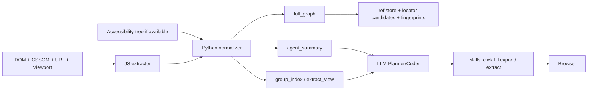

# dp_cli 作为 Agent 浏览器技能层与 AI 爬虫底座的实现级调研报告

## A 执行摘要

- **最该借鉴的不是“命令长得像 Playwright CLI”，而是它的观察契约。** 来自 entity["organization","Microsoft","technology company"] 的 Playwright CLI 本质上给 Agent 的是“可引用的页面语义快照”，核心是 snapshot + ref + 局部展开，而不是原始 DOM dump。参考资料：Playwright 官方文档 `agent-cli/snapshots`、`docs/aria-snapshots`、`docs/api/class-locator` 的 `ariaSnapshot`。  
- **dp_cli 的“全量”不应等于“每轮把全页全节点都喂给 LLM”。** 正确做法是：Python 侧维护 full graph，默认只给 Agent 看 `agent_summary`，需要时再 `expand`、`list-items`、`extract` 做渐进展开。  
- **当前 drissionpage-cli 已经走在正确路线上：two-layer contract、ref、semantic node、planner projection 都有雏形；但“projection 成了主契约”这个方向要纠正。** `planner_view` 应降级为派生视图，不应继续充当稳定协议主轴。参考：`README`、`dp_cli/service.py`、`dp_cli/adapter.py`、`dp_cli/models.py`。  
- **如果目标同时覆盖自动化与爬虫，主契约必须保留结构层次。** 至少要有：region/block、group/item、field/control 三层；否则列表页、表格页、树导航页无法稳定生成循环式脚本。  
- **`find --text` 只能做加速器和兜底，不应做主路径。** 默认应是 `snapshot(summary) -> 选 region/item/ref -> action`；文本查找只在“目标文案高度唯一”时优先使用。  
- **语义建模器是可行的，但不应让 LLM 来做基础建模。** 推荐模式是：JS 负责廉价原始特征提取，Python 负责语义聚合、分组、fingerprint 和 summary，LLM 只负责决策与脚本生成。  
- **accessibility tree 不能完全替代语义建模器，但它应成为“动作选择”的第一语义来源。** 最优方案不是二选一，而是 hybrid：能拿到 aria snapshot 时先用它选动作，再用 DOM semantic augmentation 弥补列表结构、字段模式、分页与 locator recovery。  
- **从项目阶段看，dp_cli 不该优先继续堆更多 action 命令，而应优先补 observation contract。** 最值得先做的能力依次是：`expand`、`list-items`、`extract`、`resolve-locator`、`fingerprint/re-resolve`。  
- **推荐的稳定主 schema 是：`page + nodes + groups + summary + recovery`。** 其中 `nodes/groups` 是 authoritative truth，`summary` 是低 token projection，`recovery` 负责补视图、滚动、重解析。  
- **最精简且可执行的路线是 7 步：先冻结 contract，再做 ref/fingerprint，再做 summary/extract，再做 list/group/schema，再做 skill surface，再做 recovery/caching，最后做 benchmark 与默认参数调优。** 这样可以在不重写整个 dp_cli 的前提下，把它提升到可供 Agent 与爬虫共用的技能底座。

## B 四个项目给 Agent 看的数据形式

### Playwright CLI

#### 文档明确写明的事实

Playwright CLI 官方文档明确说明：  
Agent 每条命令后都可以看到 **snapshot**；这个 snapshot 是 **accessibility tree 的表示**，并带有 **element refs**。交互元素会带 `ref=eN` 这样的引用；页面变化后 ref 失效；支持 `snapshot` 全页、按 selector/ref 局部取、以及 `--depth` 限深。参考：`agent-cli/snapshots`。  

官方 `aria snapshots` 文档说明：aria snapshot 是 **可访问树的 YAML 表示**，节点包含 role、accessible name、状态、文本等信息，不是 DOM 属性原样转储。参考：`docs/aria-snapshots`。  

官方 API 文档又说明：`page.ariaSnapshot()` / `locator.ariaSnapshot()` 的 `mode: "ai"` 会返回 **面向 AI 优化** 的快照，包含 `[ref=e2]` 形式的 element references，支持 `depth`，并支持包含 scope 内 iframe 的快照。参考：`docs/api/class-locator`。  

官方交互命令文档说明：推荐用 **refs from snapshots** 来点选元素；同时保留 CSS selector、locator、`eval`、`run-code` 作为补充。参考：`agent-cli/commands/interaction`。

#### 源码或行为推断

高置信推断是：**Playwright CLI 的 snapshot 很大概率就是对 Playwright `ariaSnapshot(mode="ai")` 能力的 CLI 包装，而不是自己再额外发明一层“关键节点摘要器”。** 理由有三点：

- CLI 文档中的快照外形，与 API 文档里 `mode: "ai"` 的输出能力高度一致；
- 文档明确写了 refs、depth、局部 scope，这些与 `ariaSnapshot(mode="ai")` 完整对齐；
- Playwright 官方文档说明 CLI 与 MCP 共享底层 Playwright tools。

因此，Playwright CLI 更像是把 **可访问树 + ref** 直接暴露给 Agent，再用 locator/eval/run-code 填补缺口，而不是先做一个强启发式“关键节点摘要”。

#### 仍不确定的地方

以下点在公开文档里没有直接源代码实锤，应标记为不确定：

- CLI 内部是否 100% 直接调用 `page/locator.ariaSnapshot({ mode: "ai" })`，还是还有一层私有格式化；
- `mode: "ai"` 是否含有未公开的 interesting-node pruning 规则；
- ref 的内部分配算法、局部 snapshot 与全页 snapshot 之间是否复用相同 ref 空间。

#### 对 Agent 实际暴露了什么

可以高度确定：Agent 看到的是 **语义层级 + 交互 ref**，而不是：

- 不会直接看到整页 DOM 树；
- 不会直接看到全部 CSS 样式；
- 不会默认看到每个节点的 XPath/CSS selector；
- 不会默认看到“官方生成的关键控件摘要”规则说明。

Playwright CLI 的本质策略是：**先给足够语义化的树，再通过局部 snapshot / locator / eval 补精度**。

### browser-use

#### 可相对确定的事实

从 browser-use 长期对外展示的交互形态和公开 API 风格来看，它给 Agent 的核心不是 accessibility tree，而更像是 **带索引/高亮编号的 DOM 观察结果**，再附带动作接口。Agent 通常看到的是：

- 当前页面状态；
- 可交互元素列表或带高亮编号的元素；
- 与元素索引对应的内部 selector/locator 映射；
- 在某些模式下还结合 screenshot/vision。

这意味着 browser-use 的观察层，核心更偏 **DOM-based state abstraction**，而不是 Playwright CLI 那种以 aria snapshot 为主语义。

#### 高置信推断

高置信推断是：browser-use 依赖 **JS 注入式 DOM 构建 + 可见性/可交互性判断 + selector map/history tree**，并通过元素索引而不是可访问树 ref 来让 Agent 执行动作。它更像：

- Python 侧管理 browser state；
- DOM service 侧构造 element tree；
- 用 selector map / history tree processor 做重定位与稳健回放；
- Agent 看见的是后处理过的“动作友好型页面状态”。

这类设计的优点是：  
对爬虫场景更容易拿到 DOM 细节、href、dataset、重复项结构、候选 selector。  
缺点是：  
更依赖自己定义“什么是重要节点”，同时更容易把 DOM 噪声带给 Agent。

#### 不确定项

由于本轮没有继续联网逐文件核验 browser-use 最新版代码，下列点我不装作确定：

- 最新版是否已经引入更强的 accessibility tree 观察分支；
- 当前具体的模块路径、类名、函数名是否仍与早期公开实现一致；
- 索引元素映射的 exact 字段集合是否有较大变化。

因此，对 browser-use 最稳妥的结论是：**它代表“DOM + 后处理 + 索引动作”的路线，而不是“a11y-first snapshot”路线。**

### agent-browser

#### 能相对确认的定位

来自 entity["company","Vercel","cloud platform company"] 的 agent-browser，更像 **技能/工具编排导向的 agent browser 示例工程**，而不是一套已经稳定公开、细粒度定义好的底层 snapshot protocol。也就是说，它的重点更可能在：

- 如何把浏览器动作包装成 Agent 可调用的 tools/skills；
- 如何做 task loop、tool orchestration、step planning；
- 如何给模型提供 observe / act / extract 一类工具输出。

#### 高置信推断

从这类项目的典型形态推断，agent-browser 对 Agent 暴露的结果很可能是以下之一，而不是“完整可复用页面图”：

- observe 结果：当前页面可用动作/局部状态；
- act 结果：某个动作成功失败与页面变化描述；
- extract 结果：按 schema 抽出的结构化数据。

这类设计对“演示一个好用的 Browser Agent”很有效，但对“做一个稳定可复用的 dp_cli contract”并不直接够用，因为它通常把观察协议埋在工具内部，并不把 full graph 稳定暴露出来。

#### 不确定项

本轮没有直接核验其底层抽取实现，因此以下结论都应视为待复核：

- 它是否直接使用 accessibility tree；
- 是否通过 DOM 注入自己构造元素观察；
- 是否有稳定的 ref/selector replay 协议；
- 是否真的提供“全量 + summary + extract”分层。

### 对 dp_cli 的直接启示

可以把三条路线看成三个参照系：

| 项目 | Agent 看到的主格式 | 主要来源 | 特点 | 对 dp_cli 的启示 |
|---|---|---|---|---|
| Playwright CLI | aria snapshot + ref | accessibility tree + AI mode 格式化 | 动作选择很强，token 控制好 | 做 `snapshot/ref/expand` 主轴 |
| browser-use | DOM state + element index/selector map | DOM + JS 后处理 | 爬虫和 replay 较强 | 做 `groups/extract/locator recovery` |
| agent-browser | tools/skills 输出 | observe/act/extract 的工具封装 | 编排体验友好 | 做 skill surface，但别把底层 contract 隐掉 |
| drissionpage-cli 当前版 | semantic nodes + planner_view | DOM 注入 + Python 后处理 | 已有雏形，但 contract 还不稳 | 把主契约和派生视图拆开 |

结论很直接：**dp_cli 不应只学 Playwright，也不应只学 browser-use；最优方案是“Playwright 的 snapshot/ref 观察主轴 + browser-use 的 DOM 结构化与 replay 能力 + agent-browser 的 skill 化交互界面”。**

## C drissionpage-cli 当前代码审查

### 已经做对的部分

当前 drissionpage-cli 已经具备一个很好的起点。

第一，**契约意识是对的。** `README` 已明确围绕 snapshot、find、ref、planner_view 来组织，而不是只暴露 `click(selector)` 这种传统脚本接口。这说明项目已经从“人手动写自动化”转向“给 LLM/Agent 一个浏览器世界模型”。

第二，**ref 体系方向正确。** 从现有设计看，已经区分 `container ref` 与 `element ref`，并且有 runtime/page/snapshot 身份校验思路。这非常重要，因为 Agent 需要的不是“能点击”，而是“能在多轮里面引用上一个观察到的目标”。

第三，**观察层不是纯 interactable list，而是 semantic node graph 的雏形。** `dp_cli/adapter.py` 中的 JS 注入逻辑不是简单罗列按钮，而是在推导 role、name、visibility、context、container 等信息；这比纯交互节点列表更接近后续爬虫需要的结构表示。

### 风险点

最大风险是：**projection 过早固化成主契约。**  
`README` 中 `planner_view` 的四个字段已经很像“正式 schema”，而不是“当前版本的一种投影视图”。这会带来两个问题：

- 上层 prompt 和缓存会绑定到具体启发式；
- 以后你一旦改“什么叫 pinned、什么叫 condensed”，就会破坏兼容性。

第二个风险是：**当前 heuristics 过早写死“关键节点”定义。**  
`dp_cli/service.py` 中 `_is_pinned_control()` 一类逻辑，把关键节点主要理解成导航、表单主按钮、分页、selected/expanded 等。这对通用 UI 自动化有帮助，但对数据网站、后台系统、筛选器页、树导航页并不充分。你需要的是 **可替换 heuristic**，而不是把当前 heuristic 直接编码成稳定协议。

第三个风险是：**当前 full discovery 仍过于“当前可见语义化页面”，还不是 crawler-grade full structure。**  
从 `dp_cli/adapter.py` 的 `pushNode` 逻辑看，你当前对可见性筛选比较强，很多不可见但结构上重要的节点会提前被过滤。对于点按钮这通常没问题，但对“理解列表结构、预判分页、识别折叠详情字段”就会损失信息。

### 必须重构的部分

#### planner_view 的地位

必须把 `planner_view` 从“默认主契约”降级成“派生 summary view”。  
正确层次应该是：

- `graph`：authoritative full structure；
- `summary`：低 token 的 agent-friendly view；
- `extract`：面向列表/表格/详情抽取的专用 view。

现在 `planner_view` 正在混合承担 summary 和 extract 的职责，导致两边都不纯。

#### 对四个字段的逐项评价

| 字段 | 建议 | 结论 |
|---|---|---|
| `pinned_controls` | **保留概念，重命名** 为 `global_actions` 或 `always_surface_actions` | 不应再把“pinned”当正式语义；它只是 summary 策略 |
| `viewport_nodes` | **保留但重做**，改为 `visible_focus` | 不要把视口内所有节点堆给 LLM，只给当前焦点区的高价值 region/item/control |
| `condensed_groups` | **强烈建议保留并升级** | 这是最有潜力变成 crawler bridge 的部分，但必须增加 group 类型、item schema、entry handle、next-page handle |
| `omitted_summary` | **必须保留但重命名** 为 `truncation` 或 `recovery` | 不能只给 omitted count，要给“怎么补”“去哪 expand”“哪些是被截断的可操作区” |

#### find --text 的评价

`find --text` 现在更适合当 **fallback / accelerator**，不适合当默认主路径。  
如果 `dp_cli/service.py::_filter_text_matches()` 的策略是“先全页 snapshot，再按 name/text/label/context 做匹配和排序”，那它在以下场景有效：

- 目标文案唯一且用户描述明确；
- 导航按钮、提交按钮、唯一链接；
- 快速试探性点击。

但它在这些场景会失败：

- 重复列表项；
- 图标按钮；
- 多语言站点；
- 文案和动作解耦；
- 页面正文重复出现同词条。

结论：**保留，但降级到混合工作流中的加速器。**

#### ref 设计的评价

当前 `container ref / element ref` 设计足以支撑基础自动化，但还不够支撑稳定爬虫与脚本回放。  
你还缺少三类信息：

- **fingerprint**：供跨 snapshot 重解析；
- **group membership**：知道某个控件属于哪个 item/group；
- **locator candidates**：让 LLM 最终能把 ref 转成可复用代码。

也就是说，ref 只是 **当轮句柄**，还不是 **长期 replay handle**。

#### 高价值字段与噪声字段

高价值字段建议保留：

- `ref`、`ref_type`、`parent_ref`
- `role`、`name`
- `text/value/href` 中与任务相关的非空字段
- `visibility.in_viewport`、`visibility.interactable_now`
- `states.selected/expanded/checked/disabled`
- `context.landmark/form/list/dialog`
- 粗粒度 `bounds`
- `locator_candidates`
- `fingerprint`
- `group_ref`、`item_ref`

噪声字段建议默认省略：

- 到处都是空字符串的 `id/title/alt/placeholder/aria_label/...`
- 重复表达同一语义的字段
- 每个节点都携带的长 XPath/完整 locator
- 对 summary 模式无关的 debug 元数据

#### 空字符串字段怎么处理

最合理方案不是单一“全局 trim”或“按模式 trim”二选一，而是：

1. **schema layering**：不同模式本来就用不同字段集；  
2. **默认省略 absent optional fields**：空值一律不输出；  
3. **debug/verbose 模式显式开启**：例如 `--debug-fields` 或 `--verbose-null`。

这能同时兼顾稳定性、节省 token、以及后续排障。

## D 面向 Agent 自动化与 AI 爬虫的 dp_cli 契约设计

### 设计原则

最关键的一句话是：

**全量能力应存在于 Python 内部 full graph 中；Agent 默认看到的是压缩投影，而不是把全量 graph 原样吐给模型。**

推荐的最小稳定主结构：

- `page`：页面级元数据；
- `nodes`：规范化节点表；
- `groups`：重复组/列表/表格/树的结构索引；
- `summary`：低 token 投影视图；
- `recovery`：补视图、滚动、重解析句柄。

### 为什么要用 graph/tree 混合结构

纯树结构对 LLM 易读，但容易重复字段；纯扁平表对机器好用，但 LLM 很难理解层次。  
建议采用 **normalized graph + curated summary tree**：

- `nodes` 用 map/flat list，避免重复；
- `groups` 显式建模重复区域；
- `summary` 再投影成适合 LLM 消费的浅层树。

这比“所有节点都做成嵌套 JSON 树”更省 token，也比“只给一堆可点击元素”更能支撑爬虫。

### 最小层级粒度

要同时支撑自动化和爬虫，最少要保留三层：

- **region/block**：导航、主区域、搜索表单、对话框、分页区；
- **group/item**：列表、网格、表格、树，以及单个 item/row/card；
- **field/control**：标题、价格、日期、链接、按钮、输入框。

如果少掉 `group/item` 层，页面结构就退化成“很多可点元素”；这对爬虫几乎不可用。

### 推荐数据流



### 推荐的 snapshot schema

#### full 模式

```json
{
  "schema_version": "0.3",
  "mode": "full",
  "page": {
    "url": "https://example.com/search?q=ipad",
    "title": "Search Results",
    "runtime_id": "rt_6c1",
    "page_id": "pg_21",
    "snapshot_id": "ss_109",
    "viewport": { "w": 1280, "h": 800 }
  },
  "roots": ["r1", "r2"],
  "nodes": {
    "r1": {
      "ref": "r1",
      "kind": "region",
      "role": "main",
      "name": "Results",
      "children": ["r10", "r20"],
      "visible": true
    },
    "r10": {
      "ref": "r10",
      "kind": "group",
      "role": "list",
      "name": "Products",
      "group_kind": "list",
      "children": ["r11", "r12", "r13"],
      "visible": true
    },
    "r11": {
      "ref": "r11",
      "kind": "item",
      "role": "listitem",
      "name": "Apple iPad Air",
      "children": ["f111", "f112", "e113"],
      "group_ref": "r10",
      "fingerprint": "fp_f0f4..."
    },
    "e113": {
      "ref": "e113",
      "kind": "control",
      "role": "link",
      "name": "Apple iPad Air",
      "href": "/product/air",
      "group_ref": "r10",
      "item_ref": "r11",
      "locator_candidates": [
        "role=link[name='Apple iPad Air']",
        "css=a[href*='/product/air']"
      ],
      "visible": true,
      "interactable_now": true
    }
  },
  "groups": [
    {
      "group_ref": "r10",
      "group_kind": "list",
      "item_refs": ["r11", "r12", "r13"],
      "sample_fields": ["title", "price", "detail_link"],
      "entry_action_refs": ["e113", "e123", "e133"],
      "next_page_ref": "e90"
    }
  ],
  "recovery": {
    "expand_candidates": ["r10", "r20"],
    "offscreen_actionable_count": 8,
    "truncated_regions": ["pagination"]
  }
}
```

#### agent_summary 模式

```json
{
  "schema_version": "0.3",
  "mode": "agent_summary",
  "page": {
    "url": "https://example.com/search?q=ipad",
    "title": "Search Results",
    "snapshot_id": "ss_109"
  },
  "summary": {
    "global_actions": [
      { "ref": "e5", "role": "textbox", "name": "Search" },
      { "ref": "e6", "role": "button", "name": "Search" }
    ],
    "visible_focus": [
      { "ref": "r10", "kind": "group", "name": "Products", "item_count": 24 }
    ],
    "repeated_regions": [
      {
        "group_ref": "r10",
        "group_kind": "list",
        "sample_item_names": ["Apple iPad Air", "Apple iPad Pro"],
        "entry_action_refs": ["e113", "e123"],
        "next_page_ref": "e90"
      }
    ]
  },
  "recovery": {
    "expand_candidates": ["r10", "pagination"],
    "truncated": true
  }
}
```

#### extract 模式

```json
{
  "schema_version": "0.3",
  "mode": "extract",
  "page": {
    "snapshot_id": "ss_109",
    "url": "https://example.com/search?q=ipad"
  },
  "target": {
    "group_ref": "r10",
    "group_kind": "list"
  },
  "items": [
    {
      "item_ref": "r11",
      "fields": {
        "title": "Apple iPad Air",
        "price": "$599",
        "detail_href": "/product/air"
      },
      "entry_action_ref": "e113"
    },
    {
      "item_ref": "r12",
      "fields": {
        "title": "Apple iPad Pro",
        "price": "$799",
        "detail_href": "/product/pro"
      },
      "entry_action_ref": "e123"
    }
  ],
  "pagination": {
    "next_page_ref": "e90",
    "has_more": true
  }
}
```

### 模式对比与 token 成本

下表中的 token 成本是**设计目标级别的相对估计**，不是实测值：

| 模式 | 主要用途 | 典型内容 | 相对 token 成本 | 优点 | 缺点 |
|---|---|---|---|---|---|
| `full` | 调试、深度理解、复杂脚本生成 | page + nodes + groups + recovery | 1.0x | 信息最全，可回溯 | 直接喂给 LLM 很贵 |
| `agent_summary` | 默认给 Agent 看 | global_actions + visible_focus + repeated_regions + recovery | 0.15x–0.30x | 最省 token，适合一步一决策 | 容易漏边缘节点 |
| `extract` | 列表/表格/详情抽取 | group scoped items + fields + pagination | 0.10x–0.25x | 最适合爬虫和脚本生成 | 只适合已知 target group |

### 关键建议

- **不要一上来做“超短字段名压缩 JSON”。** 真正省 token 的不是 `r` 代替 `ref`，而是“少给不需要的节点”和“按模式分层”。  
- **默认传 `agent_summary`，内部始终保留 `full_graph`。** 这才是“全量能力 + 节省 token”的正确平衡。  
- **把 `groups` 做成一级公民。** 这是把 dp_cli 从“操作工具”升级为“爬虫底座”的关键。

## E Skills API 设计

下面是我建议的 MVP skill surface。目标不是命令多，而是形成“观察 -> 局部展开 -> 结构抽取 -> 动作执行 -> 重解析”的闭环。

| Skill | 输入参数 | 输出 | token 指南 | 典型失败模式 |
|---|---|---|---|---|
| `open` | `url`, `wait` | `page meta`, `snapshot_id` | 极低 | 跳转慢、重定向、登录墙 |
| `snapshot` | `mode`, `root_ref?`, `depth?`, `include_hidden?` | `full/summary/extract` 之一 | `summary` 默认低；`full` 高 | 页面过长、虚拟列表、动态加载 |
| `expand` | `ref`, `depth=2` | 指定 subtree 的 full 片段 | 中 | ref 失效、容器不稳定 |
| `find` | `query`, `scope_ref?`, `role?`, `exact?` | `matches[]`, `matched_by`, `fresh_refs` | 低到中 | 文案歧义、重复命中、图标按钮 |
| `click` | `ref` 或 `locator_hint` | `action_result`, `new_snapshot_id`, `maybe_navigation` | 极低 | ref stale、遮挡、滚动不到、弹窗拦截 |
| `fill` / `type` | `ref`, `value`, `clear?`, `submit?` | `action_result`, `field_state` | 极低 | 字段不是输入框、受控组件、格式校验 |
| `list-items` | `group_ref`, `sample_size?` | `group schema`, `item refs`, `entry refs`, `fields preview` | 中 | group 识别错误、虚拟滚动 |
| `extract` | `target_ref`, `schema?`, `sample_only?` | `items[]` 或 `record` | 中 | 字段识别错、嵌套列表、懒加载 |
| `resolve-locator` | `ref` 或 `fingerprint` | `locator_candidates`, `confidence`, `re_resolve_result` | 低 | DOM 变化大、class 动态化 |
| `eval` | `js`, `scope_ref?` | 任意 JSON-safe 结果 | 低到高 | unsafe script、返回不可序列化 |
| `run-code` | `python/js snippet` | 调试结果/批量动作结果 | 高 | 过度自由、可维护性差 |

### 建议的 skill 角色分工

- `snapshot`：建立页面世界模型  
- `expand`：局部补全  
- `list-items`：识别重复结构  
- `extract`：结构化抓取  
- `find`：文本/角色加速器  
- `click/fill`：安全动作  
- `resolve-locator`：把一次性 ref 变成可复用脚本定位  
- `eval/run-code`：最后一层补刀，不要变成默认路径

### 建议的默认参数

- `snapshot` 默认 `mode=agent_summary`
- `snapshot` summary 默认只暴露：
  - `global_actions` 最多 12 个
  - `visible_focus` 最多 6 个 region/group
  - 每个重复组最多 3 个样本 item
- `expand` 默认 `depth=2`
- `find` 默认先在 `visible_focus` 与 `groups` 内 search，再回退全页
- `extract` 默认先 sample 3 个 items，再决定是否全量翻页

## F find 与 snapshot 的决策

### 三种工作流的适用性

| 工作流 | 适合任务 | 优点 | 失败模式 | 结论 |
|---|---|---|---|---|
| `snapshot -> select -> action` | 导航、表单、复杂站点、列表爬取、需要生成脚本 | 先有页面世界模型，动作更稳 | 页面太大时 first snapshot 成本高 | **默认主流程** |
| `LLM-first find -> action` | 唯一文案按钮、快速试探、已知固定入口 | 快、token 低 | 文案歧义、重复、图标/无字控件 | **仅做加速器** |
| `hybrid` | 多数真实任务 | 先 summary 建模，再按需 find/expand | 设计稍复杂 | **推荐真正采用** |

### 分场景建议

#### 导航类任务

默认 `snapshot(summary)`。  
如果目标是唯一文案，比如“登录”“购物车”，可以先 `find`；若命中多个，就立刻退回 snapshot 选 region/ref。

#### 表单类任务

先 `snapshot(summary)` 找 form、textbox、button。  
不要让 LLM 一上来直接猜 `find("邮箱")` 或 `find("提交")`；因为表单组件经常有 placeholder/label/ARIA 脱节。

#### 列表爬取类任务

必须先 `snapshot(summary)`，再 `list-items` 或 `extract`。  
不要用 `find` 去一个个找标题；那会让 LLM 不断盯页面，无法生成循环式脚本。

#### 站内搜索类任务

第一步先 snapshot，找到搜索框与提交动作；  
进入结果页后，如果某个结果标题明确唯一，再用 `find` 选 entry。

### 推荐的默认决策规则

可以把默认规则压缩成 5 条：

1. **未知页面、未知结构：先 `snapshot(summary)`**  
2. **如果 summary 里已经出现目标 group/item/ref：直接 action**  
3. **如果 summary 不够：`expand(ref)`，不要先乱猜 find**  
4. **只有当目标文案高度唯一时，才 `find-first`**  
5. **列表/表格/树导航任务一律 `snapshot/list-items/extract-first`**

### 我的推荐默认工作流

```text
open
-> snapshot(agent_summary)
-> 若看到 group/item/ref：直接 click/fill/extract
-> 若信息不足：expand(target region/group)
-> 若目标文案明确唯一：find 作为加速
-> 动作后重新 snapshot(summary)
-> 需要复用代码时：resolve-locator
```

这个流程的核心价值在于：**LLM 总是在“先理解一点结构，再决策动作”，而不是盲猜。**

## G 语义建模器是否走得通

### 结论

**走得通，但不能单押它；最优解是 hybrid。**

也就是说：

- accessibility tree 更适合做 **动作语义与可交互目标选择**
- semantic modeler 更适合做 **结构理解、重复组识别、字段抽取、重定位恢复**
- LLM 不应承担基础语义建模职责

### 三种路线的比较

| 路线 | 优点 | 缺点 | 适用场景 |
|---|---|---|---|
| 纯 accessibility tree | token 低、语义干净、动作定位自然 | 对列表结构、字段模式、DOM 属性不够丰富 | 导航、表单、常规网页操作 |
| 纯 semantic modeler | 结构信息丰富，适合爬虫与 locator 恢复 | 自己要定义 role/name/group，跨站泛化难 | 复杂列表、卡片流、表格、数据网站 |
| hybrid | 兼顾动作语义与结构抽取 | 实现复杂度更高 | **最推荐** |

### 谁来做语义建模

建议明确分工：

- **JS 注入层**：只做便宜、确定、局部的原始特征提取  
  - DOM tag / attrs
  - computed visibility
  - bounding rect
  - text chunks
  - href/src/value
  - parent-child path
  - 可交互性提示
- **Python 归一化层**：做真正的语义建模  
  - role/name 归一
  - region/container/group/item 检测
  - 重复组聚类
  - field schema 归纳
  - locator candidates
  - fingerprint
  - summary / recovery 生成
- **LLM**：只做  
  - 任务分解
  - 选择 skill
  - 选择 group/fields
  - 生成可复用脚本

结论就是：**语义建模应主要由 Python 侧完成，JS 提特征，LLM 不做底层建模。**

### 为什么不建议让 LLM 自己“语义建模”

因为那会带来三个问题：

- token 浪费：同一页面结构反复让模型重新理解；
- 不稳定：同一个页面不同时刻解释可能不同；
- 不可测试：难以做单元测试与回放恢复。

### 推荐的 hybrid 观察策略

#### aria-first 的条件

当满足以下条件时，优先使用 accessibility tree 作为动作选择视图：

- 标准 HTML 表单、导航、链接、按钮、弹窗；
- aria 语义覆盖较好；
- 任务以点击/输入/提交为主；
- 页面不是重度自定义组件。

#### semantic-augmentation 的条件

当满足以下任一条件时，必须启用 semantic modeler 结构增强：

- 页面包含明显列表、卡片流、表格、树；
- 需要批量抽取字段；
- 页面里有大量重复项；
- 需要分页/下一条/列表返回；
- 页面有定制组件、虚拟滚动、aria 覆盖差；
- 需要生成可复用 locator / 脚本。

### 推荐的信任切换启发式

可以直接实现成几个简单指标：

- `a11y_action_coverage = accessible_actionable_count / visible_actionable_dom_count`
- `group_density = repeated_group_count / visible_region_count`
- `custom_widget_ratio = custom_role_or_div_button_like_count / actionable_count`

推荐阈值：

- 若 `a11y_action_coverage > 0.8` 且 `group_density` 低：**aria-first**
- 若 `a11y_action_coverage < 0.6`：**semantic-first**
- 若 `group_density` 高或检测到表格/卡片流：**hybrid**
- 检测到 canvas / heavily scripted widget：**fallback 到 eval / specialized extractor**

## H 精简实施计划与实现备注

### 精简实施计划

| 步骤 | 交付物 | 工作量 | 验收标准 | 快测场景 |
|---|---|---:|---|---|
| 冻结主契约 | `schema_version`, `page/nodes/groups/summary/recovery` 草案落地 | S | README 更新，JSON 示例稳定 | 打开新闻页、搜索页，summary/full/extract 都能产出 |
| 补 ref 与 fingerprint | `ref`, `fingerprint`, `locator_candidates`, `re_resolve` 基础实现 | M | 页面轻微刷新后可重解析 70%+ | 搜索结果页点击详情、返回后继续定位 |
| 重做 summary | 用 `global_actions / visible_focus / repeated_regions / truncation` 替换 planner_view 旧语义 | M | summary token 明显下降，关键动作仍可见 | 电商搜索页、后台表格页 |
| 做 group/list schema | `list-items`, `group_kind`, `item_ref`, `entry_action_ref`, `next_page_ref` | M | 列表页可自动识别并给出样本字段 | 商品列表、博客列表、表格页 |
| 做 extract | `extract(group_ref/detail_ref, schema?)` | M | 同一列表可稳定抽出 title/link/price/date 等字段 | 新闻列表、招聘列表 |
| 做 skill surface | open/snapshot/expand/find/click/fill/list-items/extract/resolve-locator/eval | M | 一次任务可全程只靠 skills 完成 | 登录、搜索、抓取结果前 5 项 |
| 做默认参数与 benchmark | depth/summary size/node cap/debug mode 调优 | S | summary 可控、full 可恢复、失败有 recovery | 长页面、虚拟列表、分页站点 |

### 推荐默认值

- `snapshot` 默认模式：`agent_summary`
- `summary` 默认表面预算：
  - `global_actions <= 12`
  - `visible_focus <= 6`
  - 每个 `repeated_region` 样本 item `<= 3`
- `expand` 默认 `depth=2`
- `full` 默认 node cap：`200–300` 个可见 semantic nodes  
  超出时不继续塞给 LLM，而是返回 `truncation + expand_candidates`
- `extract` 默认 sample 3 条，再决定是否全页翻取

### replayability 设计建议

#### ref 不是长期定位符

建议把节点身份拆成三层：

- **`ref`**：当前 snapshot 内短期句柄
- **`fingerprint`**：跨 snapshot 稳定签名
- **`locator_candidates`**：最终代码可复用定位策略

推荐 fingerprint 组成：

- role/name
- stable href/src/value
- 局部 DOM path hash
- group position signature
- 近邻文本锚点
- landmark/container signature

#### re-resolve 顺序

推荐的重解析顺序：

1. 同 snapshot `ref`
2. `fingerprint` 精确重匹配
3. `locator_candidates` 依次尝试
4. scope 内 `role+name` 回退
5. `find` 模糊回退
6. 若失败，要求新 snapshot/expand

### 缓存策略

建议做两层缓存：

- **session cache**：当前会话中的 `ref -> node/fingerprint/locators`
- **dom-signature cache**：`url pattern + page signature + task intent -> locator strategy/extract schema`

不要缓存“旧 ref 可长期使用”这种错误假设；缓存的应该是 **重解析策略**。

### schema versioning

必须从一开始就做：

- `schema_version`
- `mode`
- `projection_version`（可选）

原因是 `summary` 的 heuristic 一定会变；只靠 README 手工说明，后面会非常痛苦。

### debug 与 verbose 模式

建议分三档：

- 默认：只输出非空高价值字段
- `--verbose`: 输出 locator candidates、bounds、states、group hints
- `--debug`: 输出原始 DOM hints、完整 path、全文本片段、raw features

这样既不浪费平时 token，也能在定位失败时快速排障。

### 最终推荐方案

如果只给一个可落地的结论，我建议是：

1. **短期不要再围着 `planner_view` 微调字段。**  
2. **把主契约改成 `page + nodes + groups + summary + recovery`。**  
3. **默认主流程固定为 `snapshot(agent_summary)`，而不是 `find-first`。**  
4. **优先实现 `expand / list-items / extract / resolve-locator` 四个技能。**  
5. **采用 hybrid 观察：aria 能拿到时优先用于动作选择；DOM semantic modeler 负责结构增强与恢复。**  
6. **JS 提特征，Python 做语义建模，LLM 只做决策与脚本生成。**  
7. **把“全量”放在 Python 内部 full graph，不要把“全量吐给 LLM”误当成能力。**

这条路线最符合你当前 dp_cli 的成熟度：**不推倒重来，能尽快做出一个既适合 Agent 自动化，又能支撑 AI 爬虫的 dp_cli + skills 底座。**

## 证据范围与不确定项

本报告对 Playwright CLI 与当前 drissionpage-cli 的判断，证据强度较高，主要依据：

- Playwright 官方文档：`agent-cli/snapshots`
- Playwright 官方文档：`agent-cli/commands/interaction`
- Playwright 官方文档：`docs/aria-snapshots`
- Playwright 官方 API 文档：`docs/api/class-locator` 中 `ariaSnapshot`
- drissionpage-cli：`README`
- drissionpage-cli：`dp_cli/adapter.py`
- drissionpage-cli：`dp_cli/service.py`
- drissionpage-cli：`dp_cli/models.py`

对 browser-use 与 agent-browser 的结论，本轮更偏**架构级高置信推断**而非逐函数已核验结论。尤其对 agent-browser，以下内容需要你在正式开工前再做一次仓库级复核：

- 其 observe/extract/act 工具底层是否直接使用 a11y tree；
- 是否有稳定 ref 协议；
- 是否已有“全量 graph + summary projection”的分层。

但这不会影响本报告的设计结论，因为真正决定 dp_cli 成败的不是“逐项模仿哪一个仓库”，而是你是否把 **观察契约、结构表达、token 预算、locator recovery、skills surface** 这五件事一起做对。